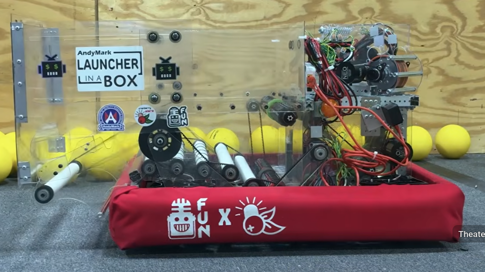
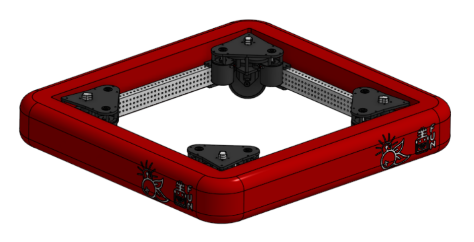
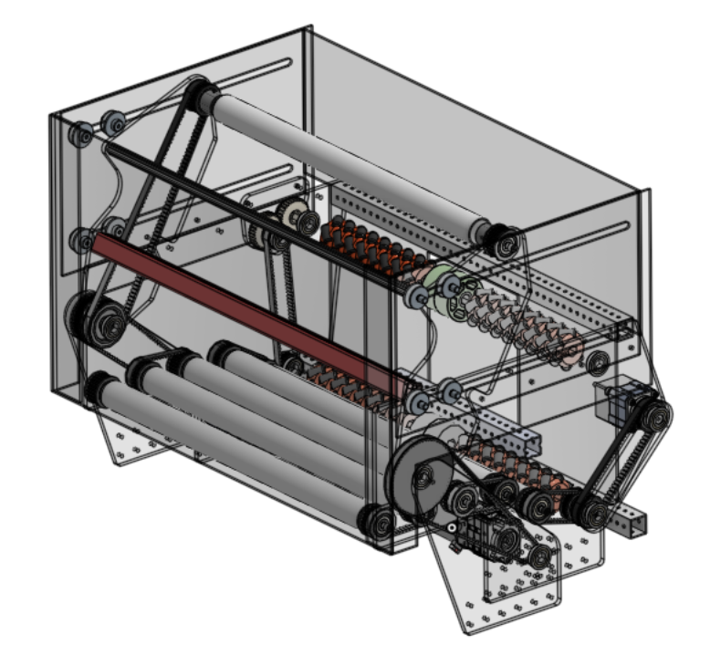
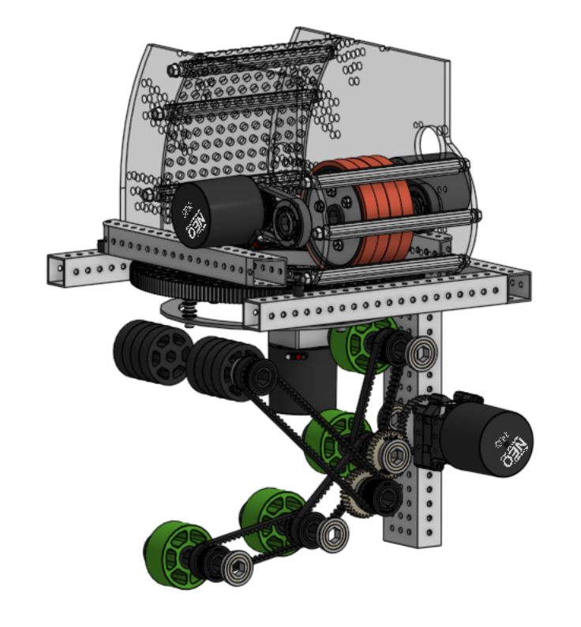

# Best practices when building a CAD model
* This is intended to be advice for FRC teams scrambling to quickly scour online resources for ideas on how to proceed with their own robot designs.

## How should the CAD model be structured?
* Ideally, the CAD model of the robot should contain a few **Major Subassemblies** that bolt together to complete the **Top Assembly** (which represents the complete robot).
    * Each of those major subassemblies may further comprise smaller subassemblies, creating a **hierarchical assembly structure**.
* To illustrate this, I will use the example of the [Cranberry Alarm Ri3D - 2026 - Mini Fridge](https://www.youtube.com/watch?v=mV85fHC1xJ4). This video reveals a robot which was designed and built in 3 days. The CAD model has been shared [here](https://funroboticsnetwork.com/cacad26). This CAD model *does not have a hierarchical assembly structure* and is thus pretty difficult to navigate. (In fairness to the team that produced it, they were scrambling to get something out in 3 days so they can be forgiven.)

#### What would be the **Best Practice** for building this CAD model?
* Let's assume that the robot team decides to implement some of the features of this robot into their own design.
* The first step would be to identify the **major subsystem assemblies** as shown below:

Name of subsystem | Image
------------------|-------
Chassis | 
Hopper & Intake | 
Feed & Shooter | 

#### The existing CAD file is not broken into sub-assemblies this way.
* But it would certainly be advantageous to structure the CAD file this way.
    * It would make it easier to navigate.
    * Multiple people could work simultaneously on the robot design, each on a different subsystem.
    * It would make it easier to design the mechanical connections between subsystems
    * It would make it easier to facilitate service in the pit if subsystems were designed to be quickly removable.
* I would suggest that our robot design team undertake to replicate the Cranberry Alarm robot but using a **top down assembly structure**.
    * This would be excellent practice for all on the CAD team.
    * It would be helpful to further break the major assemblies into component subassemblies.
        * The shooter (AndyMark Launcher in a Box) is rotationally mounted to operate as a rotating turret, so this is is an obvious sub-assembly. 
        * The intake & hopper could be broken into component subassemblies, making it possible to show the pivoting motion of the intake w/r/t the fixed part of the hopper, and showing the moving part of the hopper being pushed to slide out.
    * The CAD model could then be used to demonstrate mechanisms as animations.
    * This futher allows the CAD model to be used to investigate part clearances during the animation cycle, discovering (and avoiding) any interferences early in the design process.
